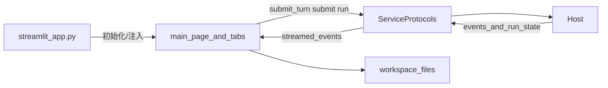

## `dayu.web` 开发说明

本文档说明 `dayu.web` 下 Web 适配层的当前实现边界，重点说明 Streamlit 模块。

## 1. 模块定位

- `dayu.web` 是 UI 适配层，负责把宿主入口请求转成 `Service` 调用，并把结果渲染给用户。
- 当前 Web 有两条并行入口：
  - Streamlit UI：`dayu/web/streamlit_app.py`（用户交互主入口），为用户提供本地访问的 Web 页面
  - FastAPI：`dayu/web/fastapi_app.py`（HTTP API 入口）,为独立的 Web 服务提供 API 接口。
- 设计基线保持稳定分层：`UI -> Service -> Host -> Agent`。

细分职责如下：

| 入口文件 | 目标对象 | 主要职责 | 不负责 |
| --- | --- | --- | --- |
| `dayu/web/streamlit_app.py` | 人工交互用户（浏览器页面） | 页面级 UI 交互、会话状态管理（`st.session_state`）、页面路由与本地文件预览入口装配 | 对外 HTTP API 契约、路由 schema 设计 |
| `dayu/web/fastapi_app.py` | 程序化调用方（HTTP 客户端/Worker） | API 装配、路由注册、请求/响应契约与后台任务受理边界 | 页面渲染、前端会话态维护、Streamlit 组件状态 |

统一约束：

- 两条入口都遵循 `UI -> Service -> Host -> Agent`，不允许 UI 直接绕过 `Service` 调 `Host` 内部细节。
- `streamlit_app.py` 可以维护 UI 会话状态，但不扩展成通用 API 网关。
- `fastapi_app.py` 负责稳定 API 契约，但不承载 Streamlit 页面行为或页面状态。
- 同一业务能力优先复用同一组 `ServiceProtocol`，保证 CLI / Streamlit / FastAPI 语义一致。

## Streamlit Web 核心功能

- 初始化配置，并配置各个场景的模型
- 配置自选股
- 下载个股财报，目前支持从SEC下载财报
- 交互式分析，目前未保存会话历史，刷新页面将开启新的会话
- 分析报告，支持生成完整的分析报告，查看报告详情(Service未暴露分析过程的详细信息，暂时通过跟踪draft输出的文件跟踪任务状态)，并导出为Markdown、PDF、Html等格式的完成报告

## 3. 页面职责与边界

### `main_page`

- 未选中股票：展示欢迎信息与操作指引。
- 选中股票：进入三个功能页签并注入 `workspace_root` 与对应服务。

### `filing_tab`

- 调用 `FinsService` 提交下载流程并消费下载事件。
- 使用 `fins.storage` 仓储读取已下载文档列表和元数据用于展示。
- 通过 `FileServerHandle` 生成本地可访问文件 URL（新标签打开）。

### `chat_tab`

- 组装 `ChatTurnRequest` 并通过 `ChatServiceProtocol.submit_turn()` 发起轮次。
- 将异步 `AppEvent` 流桥接到 Streamlit 同步渲染路径。
- 按股票维度维护 `session_id`、消息历史与输入状态。
- 当后端返回 warning/error 且主文为空时，页面保留当前帧展示错误，不立即 `rerun` 覆盖提示。

### `report_tab`

- 使用 `WriteServiceProtocol.run()` 启动报告任务。
- 使用 `HostAdminServiceProtocol` 执行 `list_runs`、`get_run`、`cancel_run` 管理与观测。
- 读取 `workspace/draft/<ticker>/` 下产物展示报告与中间状态。

### 自选股管理（`sidebar` + `watchlist_dialog`）

- 左侧栏负责展示自选股列表与当前选中标的，管理入口由对话框组件承载。
- 用户可在对话框中新增、编辑、删除自选股；保存后侧栏刷新并保持当前选择一致性。
- 自选股持久化文件固定为 `workspace/.dayu/streamlit/watchlist.json`，页面刷新后不会丢失。

## 4. 会话状态约定（`st.session_state`）

全局初始化键（入口层）：

- `initialized`
- `workspace_root`
- `fins_service`
- `write_service`
- `chat_service_client`
- `host_admin_service`
- `file_server_handle`

页面级状态（按需）：

- 侧栏：`selected_ticker`、`watchlist_needs_refresh`
- 财报下载：`active_downloads`、下载设置相关键
- 聊天：按 `ticker` 派生的 `messages` / `session_id` / 输入框键
- 报告：`active_write_tasks`、`write_task_settings`

## 5. 数据与事件流

说明：

- Tab 页面只消费 `Service` 协议，不直接操作 `Host` 实现对象。
- `Host` 的运行态观测与取消通过 `HostAdminService` 暴露，不向 UI 泄漏 Host 内部细节。

## 6. 路径与文件约定

- 自选股文件：`workspace/.dayu/streamlit/watchlist.json`
- 报告目录：`workspace/draft/<ticker>/`
  - 常见产物：`run_summary.json`、`<ticker>_qual_report.md`、`manifest.json`、`chapters/`
- 财报文件目录：`workspace/portfolio/<ticker>/filings/<document_id>/...`
- 本地文件服务仅允许访问受限财报路径，不开放任意工作区文件访问。

## 7. 开发约束（Web 侧）

- 页面层保持 `UI -> Service` 调用，不新增 `UI -> Host` 反向穿透。
- 业务写路径遵循既有仓储与服务边界，UI 读取文件仅用于展示。
- 新增页面功能时，优先复用 `ServiceProtocol`，避免在 UI 内拼装跨层流程。
- 状态键新增时应遵循“全局键最少、页面键按 ticker 隔离”的原则，避免串会话。

## 8. 运行方式

- CLI 入口：`dayu-web`
- 模块入口：`python -m dayu.web`
- 直接运行：`streamlit run dayu/web/streamlit_app.py`
- 工作区可通过 `--workspace` 指定。

## 9. TODO

- 支持配置 相关模型的 API_KEY
- 支持上传财报
- 支持上传电话会议材料
- 支持多会话管理
- 支持详细的报告执行状态展示
- 支持取消报告生成任务
